# AfriPay — Plateforme de Traitement des Paiements pour l'Afrique

> Une passerelle de paiement multi-fournisseurs de niveau production, construite avec .NET 9, DDD et CQRS — conçue pour l'écosystème fintech africain.

[](https://dotnet.microsoft.com)
[](https://www.postgresql.org)
[](https://redis.io)
[](https://www.docker.com)
[](LICENSE)

---

## Table des Matières

- [Vue d'ensemble](#vue-densemble)
- [Fonctionnalités clés](#fonctionnalités-clés)
- [Architecture](#architecture)
  - [Architecture en couches](#architecture-en-couches)
  - [Modèle de domaine](#modèle-de-domaine)
  - [Infrastructure](#infrastructure)
- [Flux de paiement](#flux-de-paiement)
  - [Cycle de vie d'un paiement](#cycle-de-vie-dun-paiement)
  - [Flux de remboursement](#flux-de-remboursement)
  - [Machine à états KYB](#machine-à-états-kyb)
  - [Pattern Outbox pour les Webhooks](#pattern-outbox-pour-les-webhooks)
- [Référence API](#référence-api)
- [Stack Technique](#stack-technique)
- [Démarrage Rapide](#démarrage-rapide)
  - [Prérequis](#prérequis)
  - [Installation locale](#installation-locale)
  - [Docker Compose](#docker-compose)
- [Configuration](#configuration)
- [Déploiement](#déploiement)
  - [Pipeline CI/CD](#pipeline-cicd)
  - [Diagramme d'infrastructure](#diagramme-dinfrastructure)
- [Supervision & Observabilité](#supervision--observabilité)
- [Sécurité](#sécurité)
- [Tests](#tests)
- [Structure du Projet](#structure-du-projet)

---

## Vue d'ensemble

**AfriPay** est une API de traitement des paiements complète, ciblant le marché africain. Elle abstrait plusieurs fournisseurs de paiement (MTN MoMo, PayPal, Stripe, Wave) derrière une interface unifiée, permettant aux marchands d'accepter des paiements en plusieurs devises avec une seule intégration.

Construite avec des patterns d'entreprise — Architecture Clean, Domain-Driven Design, CQRS via MediatR et le Pattern Outbox — AfriPay gère l'intégralité du cycle de vie d'un paiement : initiation, routage vers le fournisseur, suivi de statut, remboursements, litiges, virements, conformité KYB et livraison de webhooks en temps réel.

---

## Fonctionnalités clés

| Catégorie | Fonctionnalités |
|---|---|
| **Paiements** | Routage multi-fournisseurs, initiation idempotente, suivi de statut, annulation |
| **Remboursements** | Remboursements totaux & partiels, codes de raison, réconciliation de solde |
| **KYB/Conformité** | Upload de documents, workflow de revue en 7 étapes, validation admin |
| **Solde** | Grand livre de solde par devise et par marchand, jobs de règlement |
| **Virements** | Virements manuels & programmés, destinations bancaires / portefeuille mobile |
| **Abonnements** | Plans de facturation récurrente, renouvellement automatique, gestion des échecs |
| **Litiges** | Ouverture de contestation, soumission de preuves, résolution gagné/perdu |
| **Webhooks** | Livraison garantie via pattern Outbox, signatures HMAC-SHA256, retry exponentiel |
| **Analytique** | Résumés des ventes, analytique des virements, rapports de tendances |
| **Multi-environnement** | Environnements Live & Sandbox, clés API scopées par mode |
| **Limitation de débit** | Fenêtre glissante par plan (Starter 100/min, Growth 1000/min, Scale illimité) |
| **Observabilité** | Serilog + Prometheus + Grafana + Alertmanager |

---

## Architecture

### Architecture en couches

AfriPay suit une **Architecture Clean** avec quatre couches bien définies. Les dépendances pointent toujours vers l'intérieur — l'Infrastructure dépend de l'Application, l'Application dépend du Domaine, rien ne dépend de l'Infrastructure ou de l'API.

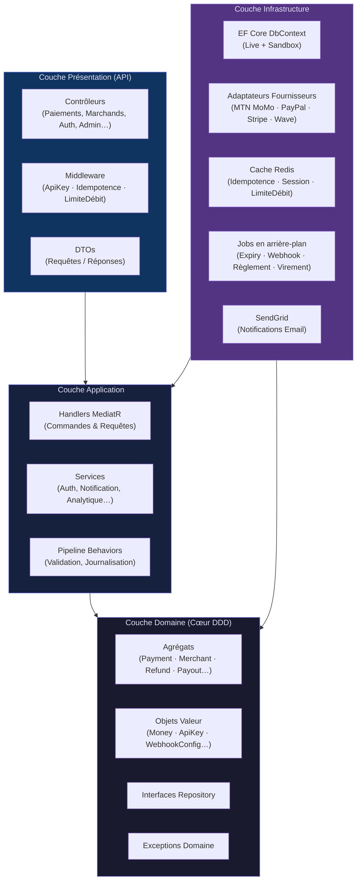

---

### Modèle de domaine

Le domaine est organisé en **contextes délimités** (bounded contexts), chacun possédant son agrégat racine, ses objets valeur et ses invariants métier.

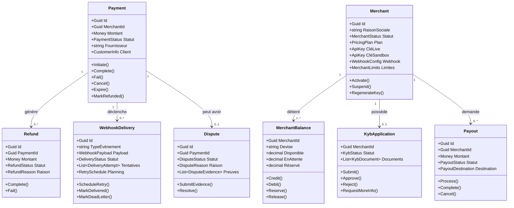

---

### Infrastructure

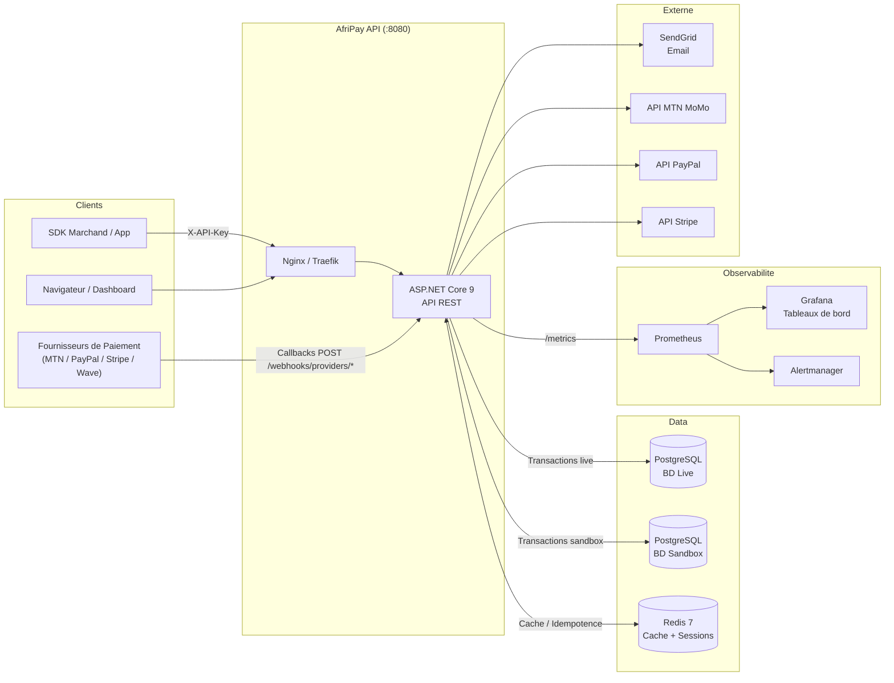

---

## Flux de paiement

### Cycle de vie d'un paiement

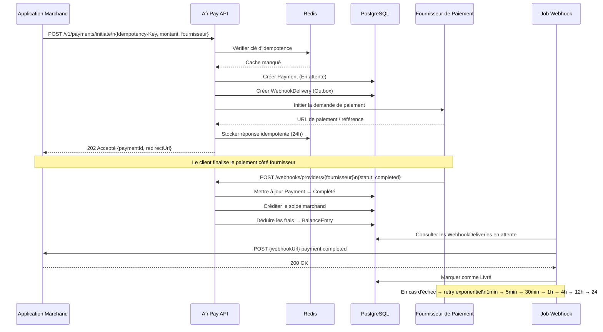

---

### Machine à états d'un paiement

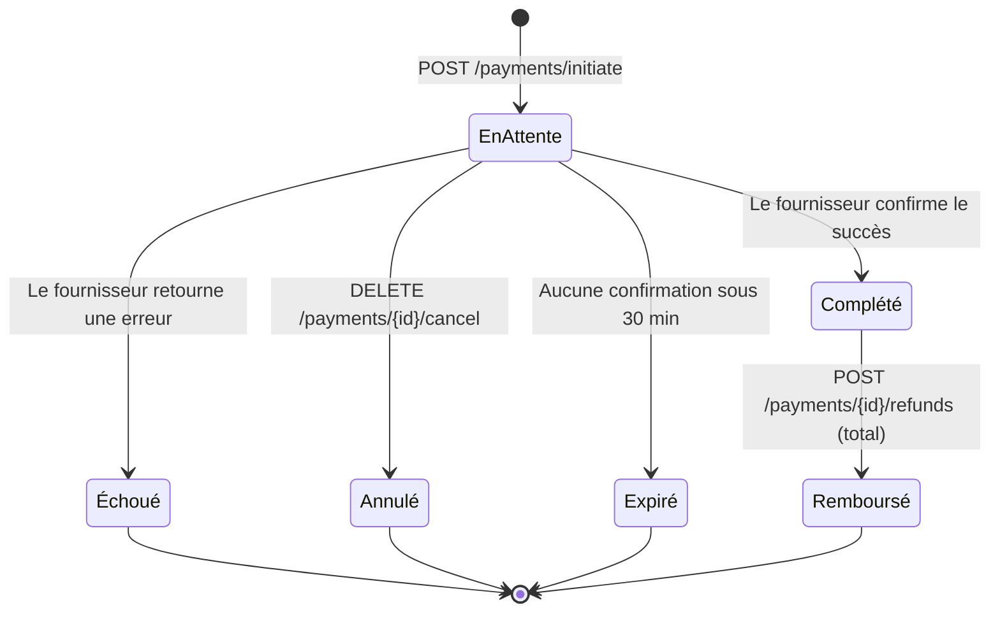

---

### Flux de remboursement

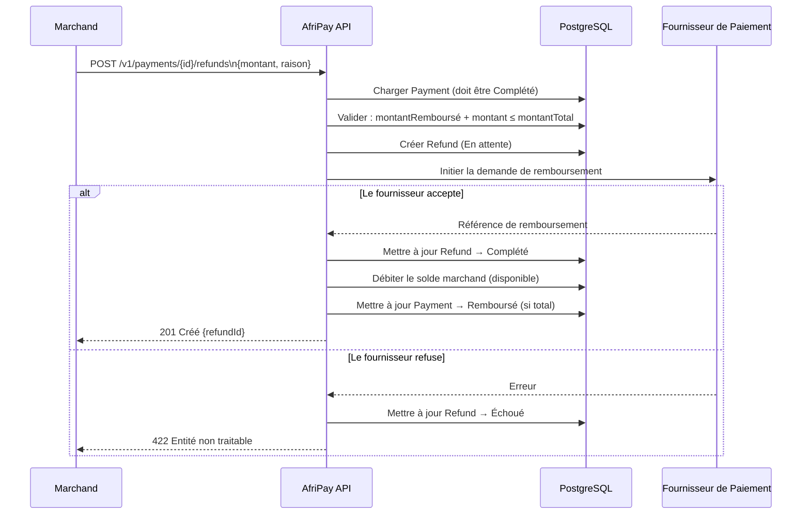

---

### Machine à états KYB

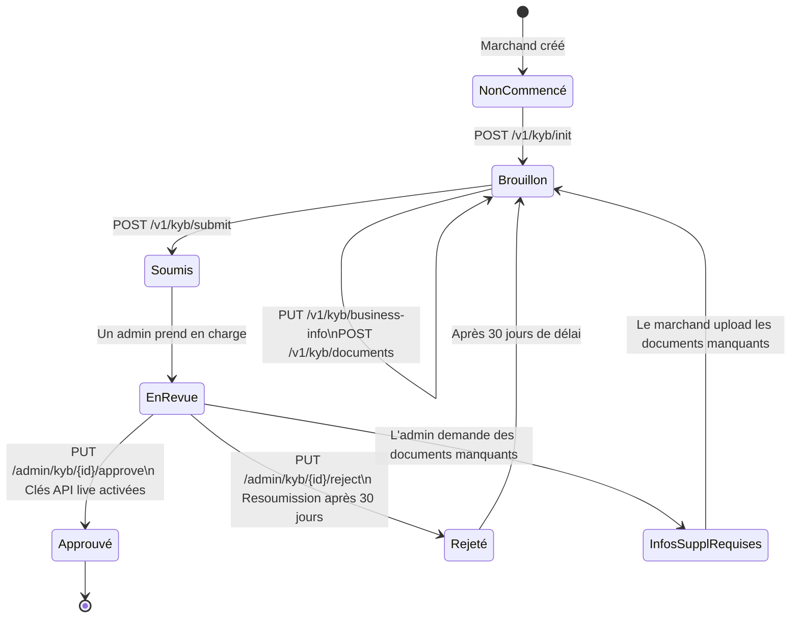

---

### Pattern Outbox pour les Webhooks

Les webhooks sont créés de manière atomique avec l'événement métier déclencheur (paiement, remboursement, etc.) et livrés de façon asynchrone par un job en arrière-plan, garantissant une livraison au moins une fois.

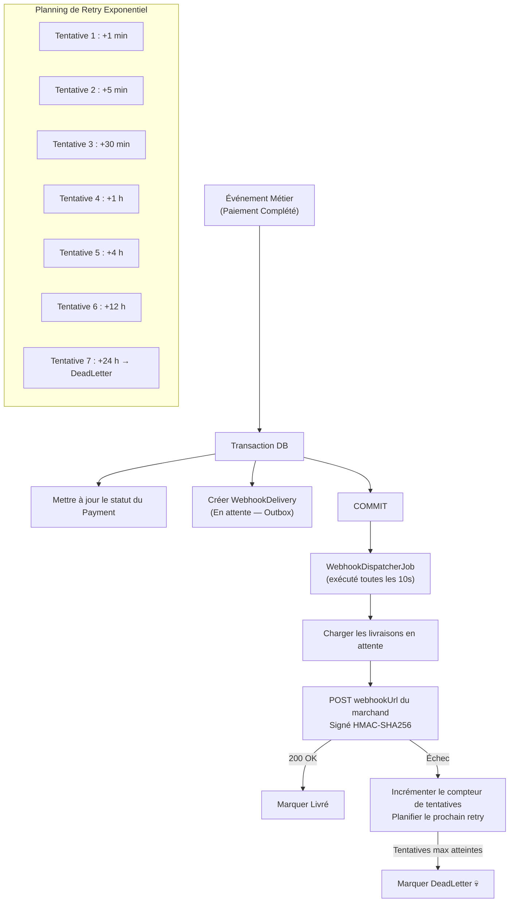

---

### Flux de litige (Contestation)

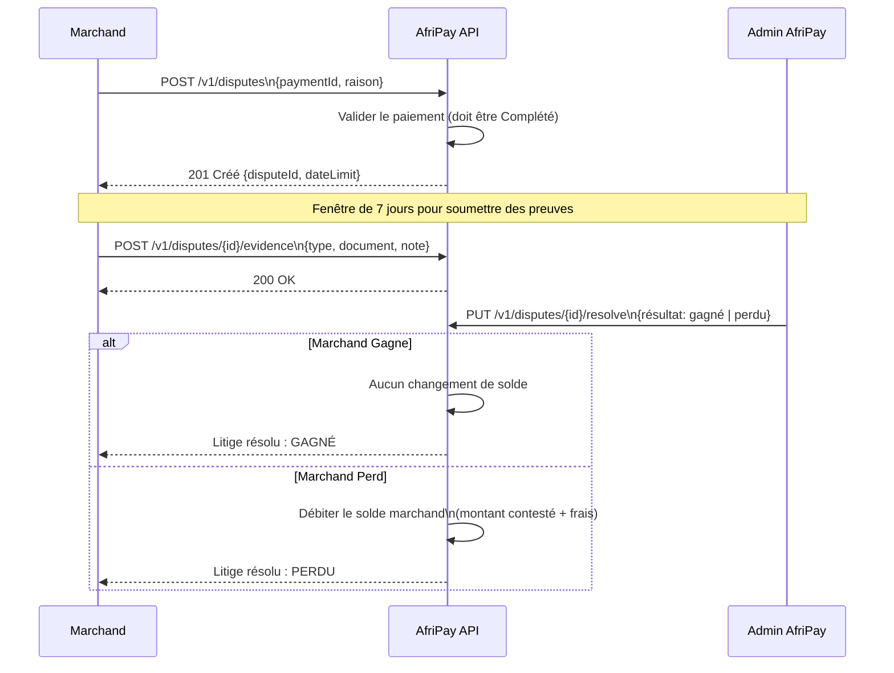

---

## Référence API

Tous les endpoints authentifiés nécessitent l'en-tête `X-API-Key: afp_live_sk_*` (production) ou `X-API-Key: afp_test_sk_*` (sandbox).

Les opérations d'écriture idempotentes acceptent l'en-tête `Idempotency-Key: <uuid>`.

### Paiements

| Méthode | Endpoint | Auth | Description |
|---|---|---|---|
| `POST` | `/v1/payments/initiate` | Requise | Initier un paiement |
| `GET` | `/v1/payments/{id}` | Requise | Détails d'un paiement |
| `DELETE` | `/v1/payments/{id}/cancel` | Requise | Annuler un paiement en attente |
| `GET` | `/v1/payments` | Requise | Lister les paiements (filtrable, paginé) |

### Remboursements

| Méthode | Endpoint | Auth | Description |
|---|---|---|---|
| `POST` | `/v1/payments/{id}/refunds` | Requise | Créer un remboursement |
| `GET` | `/v1/payments/{id}/refunds` | Requise | Lister les remboursements d'un paiement |
| `GET` | `/v1/refunds/{refundId}` | Requise | Détails d'un remboursement |

### Marchands & Authentification

| Méthode | Endpoint | Auth | Description |
|---|---|---|---|
| `POST` | `/v1/merchants` | Aucune | Créer un compte marchand |
| `GET` | `/v1/merchants/me` | Requise | Profil du marchand |
| `PUT` | `/v1/merchants/me/webhook` | Requise | Mettre à jour la configuration webhook |
| `POST` | `/v1/merchants/me/api-keys/regenerate` | Requise | Régénérer une clé API |
| `POST` | `/v1/auth/register` | Aucune | Inscription marchand |
| `POST` | `/v1/auth/login` | Aucune | Connexion (retourne JWT) |
| `POST` | `/v1/auth/refresh` | Aucune | Rafraîchir le token d'accès |
| `PUT` | `/v1/auth/password` | Requise | Changer le mot de passe |
| `GET` | `/v1/auth/me` | Requise | Utilisateur courant |

### KYB / Conformité

| Méthode | Endpoint | Auth | Description |
|---|---|---|---|
| `GET` | `/v1/kyb` | Requise | Statut KYB |
| `POST` | `/v1/kyb/init` | Requise | Initialiser la demande KYB |
| `PUT` | `/v1/kyb/business-info` | Requise | Renseigner les informations métier |
| `POST` | `/v1/kyb/documents` | Requise | Uploader un document KYB |
| `POST` | `/v1/kyb/submit` | Requise | Soumettre la demande KYB |

### Solde & Virements

| Méthode | Endpoint | Auth | Description |
|---|---|---|---|
| `GET` | `/v1/balance/{devise}` | Requise | Solde pour une devise |
| `GET` | `/v1/balance` | Requise | Tous les soldes |
| `GET` | `/v1/balance/entries` | Requise | Entrées du grand livre |
| `POST` | `/v1/payouts` | Requise | Demander un virement |
| `GET` | `/v1/payouts/{id}` | Requise | Détails d'un virement |
| `GET` | `/v1/payouts` | Requise | Lister les virements |
| `DELETE` | `/v1/payouts/{id}` | Requise | Annuler un virement en attente |

### Webhooks, Litiges & Abonnements

| Méthode | Endpoint | Auth | Description |
|---|---|---|---|
| `GET` | `/v1/webhooks` | Requise | Lister les livraisons webhook |
| `POST` | `/v1/webhooks/{deliveryId}/retry` | Requise | Relancer une livraison échouée |
| `POST` | `/webhooks/providers/{fournisseur}` | Aucune | Recevoir le callback fournisseur |
| `POST` | `/v1/disputes` | Requise | Ouvrir un litige |
| `POST` | `/v1/disputes/{id}/evidence` | Requise | Soumettre des preuves |
| `PUT` | `/v1/disputes/{id}/resolve` | Admin | Résoudre un litige |
| `POST` | `/v1/subscriptions/plans` | Requise | Créer un plan de facturation |
| `POST` | `/v1/subscriptions` | Requise | Créer un abonnement |
| `DELETE` | `/v1/subscriptions/{id}` | Requise | Annuler un abonnement |

### Administration

| Méthode | Endpoint | Auth | Description |
|---|---|---|---|
| `GET` | `/v1/admin/merchants` | Admin | Lister tous les marchands |
| `POST` | `/v1/admin/merchants/{id}/suspend` | Admin | Suspendre un marchand |
| `PUT` | `/v1/admin/merchants/{id}/plan` | Admin | Changer le plan tarifaire |
| `PUT` | `/v1/admin/kyb/{id}/approve` | Admin | Approuver une demande KYB |
| `PUT` | `/v1/admin/kyb/{id}/reject` | Admin | Rejeter une demande KYB |

### Utilitaires

| Méthode | Endpoint | Auth | Description |
|---|---|---|---|
| `GET` | `/v1/currency/rates` | Requise | Taux de change |
| `POST` | `/v1/currency/convert` | Requise | Convertir un montant |
| `GET` | `/v1/analytics/summary` | Requise | Analytique des ventes |
| `GET` | `/v1/audit/{type}/{id}` | Requise | Journal d'audit |
| `GET` | `/health` | Aucune | Vérification de santé |
| `GET` | `/docs` | Aucune | Interface Swagger |

---

## Stack Technique

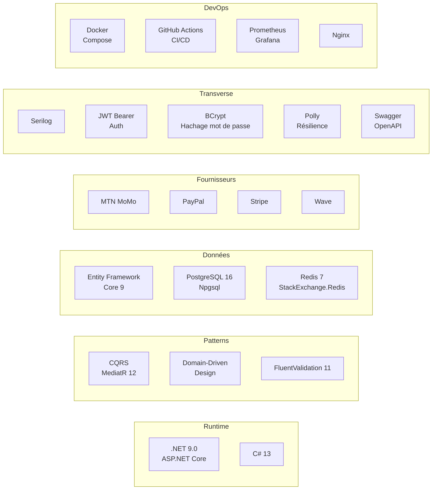

| Catégorie | Technologie | Version |
|---|---|---|
| Runtime | .NET / ASP.NET Core | 9.0 |
| Langage | C# | 13 |
| CQRS | MediatR | 12.x |
| Validation | FluentValidation | 11.x |
| ORM | Entity Framework Core | 9.0 |
| Base de données | PostgreSQL | 16 |
| Cache | Redis (StackExchange.Redis) | 7 |
| Authentification | JWT Bearer + BCrypt | — |
| Résilience HTTP | Polly | 8.6 |
| Journalisation | Serilog | 4.3 |
| Documentation | Swagger / Swashbuckle | 6.x |
| Email | SendGrid | — |
| Métriques | Prometheus + Grafana | — |
| Conteneurisation | Docker + Docker Compose | — |
| CI/CD | GitHub Actions | — |
| Proxy | Nginx | — |

---

## Démarrage Rapide

### Prérequis

- [.NET 9 SDK](https://dotnet.microsoft.com/download/dotnet/9)
- [Docker Desktop](https://www.docker.com/products/docker-desktop/) (pour l'infrastructure)
- [PostgreSQL 16](https://www.postgresql.org/download/) ou via Docker
- [Redis 7](https://redis.io/download/) ou via Docker

### Installation locale

```bash
# 1. Cloner le dépôt
git clone https://github.com/votre-org/AfriPay.git
cd AfriPay

# 2. Copier et remplir les secrets
cp appsettings.secrets.json.example appsettings.secrets.json
# Modifier appsettings.secrets.json avec vos identifiants fournisseurs

# 3. Démarrer l'infrastructure (PostgreSQL + Redis)
docker compose up postgres-live postgres-sand redis -d

# 4. Appliquer les migrations
dotnet ef database update --context LiveDbContext
dotnet ef database update --context SandboxDbContext

# 5. Lancer l'API
dotnet run --project AfriPay.csproj

# API disponible sur :  http://localhost:5000
# Interface Swagger :   http://localhost:5000/docs
```

### Docker Compose

```bash
# Stack complète (API + PostgreSQL live + PostgreSQL sandbox + Redis)
docker compose up -d

# Avec supervision (Prometheus + Grafana + Alertmanager)
docker compose -f docker-compose.yaml -f docker-compose.monitoring.yaml up -d

# Consulter les logs
docker compose logs -f afripay-api

# Vérification de santé
curl http://localhost:8080/health
```

---

## Configuration

Paramètres clés dans `appsettings.json` (les secrets vont dans `appsettings.secrets.json`) :

```json
{
  "ConnectionStrings": {
    "AfriPayLive":    "Host=localhost;Port=5432;Database=afripay_live;Username=postgres;Password=...",
    "AfriPaySandbox": "Host=localhost;Port=5432;Database=afripay_sandbox;Username=postgres;Password=...",
    "Redis":          "localhost:6379,abortConnect=false"
  },
  "Jwt": {
    "Secret":           "<secret-minimum-32-caracteres>",
    "Issuer":           "AfriPay",
    "Audience":         "AfriPay",
    "ExpiresInMinutes": "15"
  },
  "Providers": {
    "MtnMomo": {
      "BaseUrl":         "https://sandbox.momodeveloper.mtn.com",
      "SubscriptionKey": "...",
      "ApiUserId":       "...",
      "ApiKey":          "..."
    },
    "PayPal": {
      "BaseUrl":   "https://api-m.sandbox.paypal.com",
      "ClientId":  "...",
      "Secret":    "..."
    },
    "Stripe": {
      "SecretKey": "sk_test_..."
    }
  },
  "SendGrid": {
    "ApiKey":    "SG...",
    "FromEmail": "noreply@afripay.io"
  }
}
```

### Limites de débit par plan

| Plan | Requêtes/min | File d'attente |
|---|---|---|
| Starter | 100 | 10 |
| Growth | 1 000 | 50 |
| Scale | Illimité | — |

---

## Déploiement

### Pipeline CI/CD

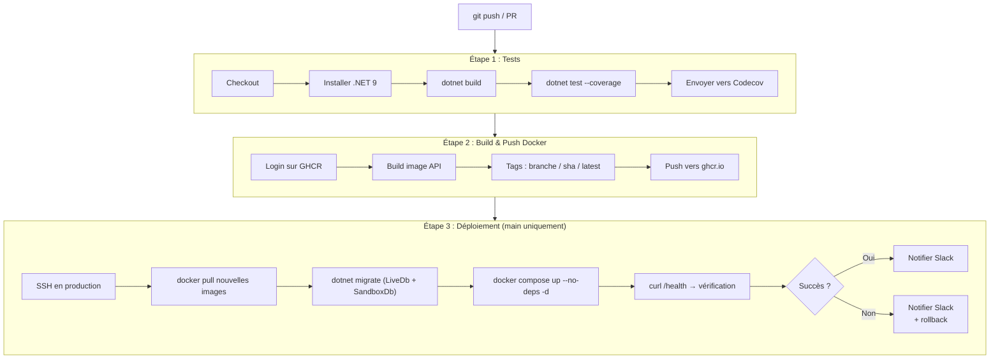

### Diagramme d'infrastructure

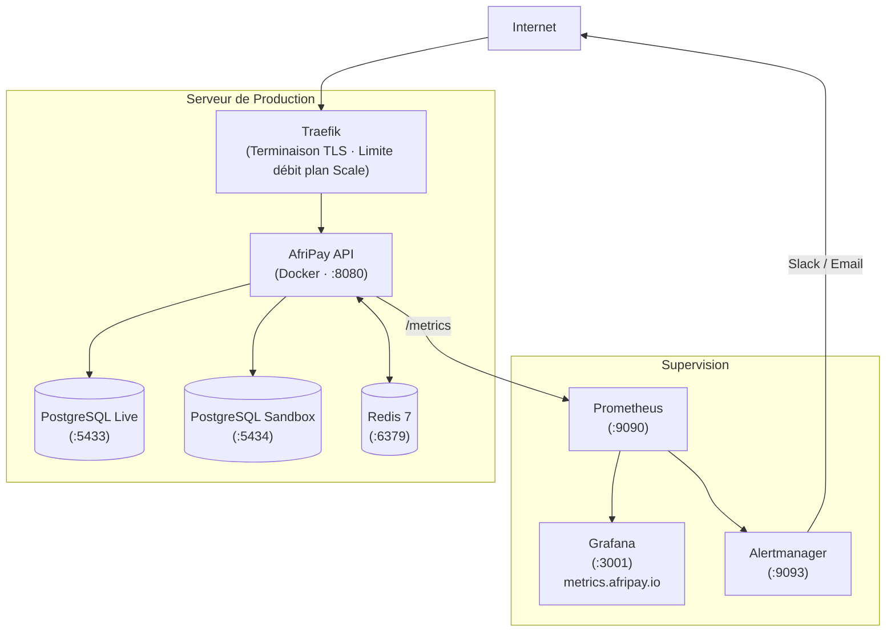

---

## Supervision & Observabilité

AfriPay embarque une stack d'observabilité complète :

| Outil | Rôle | URL |
|---|---|---|
| **Serilog** | Journalisation structurée (JSON) | stdout / fichier |
| **Prometheus** | Collecte de métriques (scrape 15s) | `:9090` |
| **Grafana** | Tableaux de bord & visualisation | `:3001` |
| **Alertmanager** | Routage des alertes (Slack/email) | `:9093` |

Les **vérifications de santé** sont exposées sur `GET /health` et couvrent :
- Base de données PostgreSQL Live
- Base de données PostgreSQL Sandbox
- Redis

**Métriques clés collectées :**
- Métriques HTTP ASP.NET Core (latence, codes de statut, débit)
- Métriques du pool de connexions PostgreSQL
- Taux de hits/miss Redis

```bash
# Démarrer la stack de supervision
docker compose -f docker-compose.monitoring.yaml up -d

# Accéder aux tableaux de bord
open http://localhost:3001   # Grafana (admin / votre-mot-de-passe)
open http://localhost:9090   # Prometheus
```

---

## Sécurité

| Mécanisme | Détails |
|---|---|
| **Authentification par Clé API** | En-tête `X-API-Key` ; clés stockées en SHA-256 ; validées via Redis (chemin rapide) |
| **Tokens JWT** | Token d'accès (15 min) + token de rafraîchissement ; claims : merchantId, email, plan |
| **Hachage des mots de passe** | BCrypt avec facteur de coût 12 |
| **Idempotence** | En-tête `Idempotency-Key` ; stocké dans Redis (TTL 24h) |
| **Signatures Webhook** | HMAC-SHA256 sur le corps du payload ; en-tête `X-AfriPay-Signature` |
| **Limitation de débit** | Fenêtre glissante par plan ; 429 en cas de dépassement |
| **HTTPS** | TLS imposé au niveau du proxy Traefik / Nginx |
| **Données sensibles** | Aucune PII dans les logs ; journalisation sensible désactivée en production |
| **Scope des clés API** | `afp_live_sk_*` pour la production ; `afp_test_sk_*` pour le sandbox — chacune scopée à sa propre base de données |

---

## Tests

```bash
# Lancer tous les tests unitaires
dotnet test tests/AfriPay.Tests.csproj

# Avec rapport de couverture
dotnet test tests/AfriPay.Tests.csproj \
  --collect:"XPlat Code Coverage" \
  --results-directory ./coverage

# Par contexte délimité
dotnet test --filter "FullyQualifiedName~Domain.Payments"
dotnet test --filter "FullyQualifiedName~Domain.Merchants"
```

**Couverture de tests par contexte délimité :**

| Contexte Délimité | Scénarios testés |
|---|---|
| Paiements | Machine à états, initiation, annulation, expiration |
| Remboursements | Remboursement total/partiel, validation des montants |
| Marchands | Génération de clé API, config webhook, limites de débit |
| Solde | Crédit, débit, réservation, entrées du grand livre |
| Frais | Calcul fixe, pourcentage, par palier |
| KYB | Transitions d'état, validation des documents |
| Litiges | Soumission de preuves, résultats de résolution |
| Devises | Conversion de paires, mise en cache des taux |
| Webhooks | Planning de retry, signature HMAC |

---

## Structure du Projet

```
AfriPay/
├── src/
│   ├── API/                        # Couche HTTP
│   │   ├── Controllers/            # 18 contrôleurs REST
│   │   ├── Contracts/              # DTOs de requête & réponse
│   │   ├── Middleware/             # ApiKey · Idempotence · LimiteDébit
│   │   ├── Extensions/             # Helpers Result → HTTP
│   │   └── Swagger/                # Configuration OpenAPI
│   │
│   ├── Application/                # Cas d'utilisation (CQRS via MediatR)
│   │   ├── Payments/               # Handlers : initier, obtenir, lister, annuler
│   │   ├── Refunds/                # Handlers : créer, obtenir, lister
│   │   ├── Merchants/              # Handlers : créer, profil, clé API
│   │   ├── Auth/                   # Login, inscription, rafraîchissement, mot de passe
│   │   ├── KYB/                    # Handlers du workflow KYB
│   │   ├── Balance/                # Handlers de requête de solde
│   │   ├── Disputes/               # Handlers de litiges
│   │   ├── Payouts/                # Handlers de virements
│   │   ├── Subscriptions/          # Handlers d'abonnements et plans
│   │   ├── Webhook/                # Handlers de livraison & retry
│   │   ├── Analytics/              # Handlers de reporting
│   │   ├── Audit/                  # Handlers du journal d'audit
│   │   ├── Admin/                  # Opérations d'administration
│   │   ├── Employees/              # Gestion des équipes
│   │   ├── Currency/               # Handlers de taux de change
│   │   ├── Notifications/          # Service email SendGrid
│   │   └── Common/                 # Erreurs partagées, behaviors, DTOs
│   │
│   ├── Domain/                     # Logique métier pure (sans dépendances)
│   │   ├── Payments/               # Agrégat Payment + machine à états
│   │   ├── Refunds/                # Agrégat Refund
│   │   ├── Merchants/              # Agrégat Merchant + clé API
│   │   ├── Balance/                # Agrégat Balance + grand livre
│   │   ├── KYB/                    # Agrégat workflow KYB
│   │   ├── Disputes/               # Agrégat Dispute
│   │   ├── Payouts/                # Agrégat Payout
│   │   ├── Subscriptions/          # Agrégat Subscription
│   │   ├── Webhooks/               # Agrégat Outbox + planning retry
│   │   ├── Fee/                    # Règle de frais & calcul
│   │   ├── Currency/               # Agrégat taux de change
│   │   ├── Audit/                  # Entité journal d'audit
│   │   ├── Staff/                  # Agrégat personnel interne
│   │   ├── Employees/              # Agrégat équipe marchand
│   │   └── Repositories/           # Interfaces repository (17 interfaces)
│   │
│   └── Infrastructure/             # Préoccupations externes
│       ├── Persistence/            # EF Core : LiveDbContext + SandboxDbContext + UoW
│       ├── Providers/              # Adaptateurs : MtnMomo · PayPal · Stripe · Wave
│       ├── Caching/                # Redis : CacheService + CacheKeys + TTL
│       └── Jobs/                   # ExpiryJob · WebhookDispatcherJob · SettlementJob · PayoutSchedulerJob
│
├── Migrations/
│   ├── LiveDb/                     # Migrations PostgreSQL live (4 phases)
│   └── SandboxDb/                  # Migrations PostgreSQL sandbox
│
├── tests/
│   └── Domain/                     # Tests unitaires par contexte délimité
│
├── Dockerfile                      # Build multi-étapes (SDK → Publish → Runtime)
├── docker-compose.yaml             # Stack de production
├── docker-compose.monitoring.yaml  # Prometheus + Grafana + Alertmanager
├── nginx.conf                      # Serveur SPA frontend
├── Prometheus.yaml                 # Configuration de collecte
├── deploy.yaml                     # Pipeline CI/CD GitHub Actions
└── AfriPay.csproj                  # Fichier projet .NET 9
```

---

## Jobs en Arrière-plan

| Job | Intervalle | Responsabilité |
|---|---|---|
| `ExpiryJob` | Toutes les minutes | Expirer les paiements en attente depuis plus de 30 minutes |
| `WebhookDispatcherJob` | Toutes les 10 secondes | Livrer les webhooks en attente ; planifier les retries en cas d'échec |
| `SettlementJob` | Quotidien | Régler les entrées de solde en attente ; passer les fonds de en_attente → disponible |
| `PayoutSchedulerJob` | Quotidien | Déclencher les virements automatiques pour les marchands avec planning journalier/hebdomadaire/mensuel |

---

## Contribution

1. Forker le dépôt
2. Créer une branche : `git checkout -b feat/ma-fonctionnalite`
3. Écrire des tests couvrant vos modifications
4. Lancer la suite de tests : `dotnet test`
5. Ouvrir une pull request — le pipeline CI s'exécutera automatiquement

---

## Licence

Ce projet est sous licence [MIT](LICENSE).

---

*Construit avec passion pour l'écosystème fintech africain.*