# AfriPay — Payment Processing Platform for Africa

> A production-grade, multi-provider payment gateway built with .NET 9, DDD, and CQRS — designed for the African fintech ecosystem.

[](https://dotnet.microsoft.com)
[](https://www.postgresql.org)
[](https://redis.io)
[](https://www.docker.com)
[](LICENSE)

---

## Table of Contents

- [Overview](#overview)
- [Key Features](#key-features)
- [Architecture](#architecture)
  - [Layered Architecture](#layered-architecture)
  - [Domain Model](#domain-model)
  - [Infrastructure](#infrastructure)
- [Payment Flows](#payment-flows)
  - [Payment Lifecycle](#payment-lifecycle)
  - [Refund Flow](#refund-flow)
  - [KYB State Machine](#kyb-state-machine)
  - [Webhook Outbox Pattern](#webhook-outbox-pattern)
- [API Reference](#api-reference)
- [Tech Stack](#tech-stack)
- [Getting Started](#getting-started)
  - [Prerequisites](#prerequisites)
  - [Local Setup](#local-setup)
  - [Docker Compose](#docker-compose)
- [Configuration](#configuration)
- [Deployment](#deployment)
  - [CI/CD Pipeline](#cicd-pipeline)
  - [Infrastructure Diagram](#infrastructure-diagram)
- [Monitoring & Observability](#monitoring--observability)
- [Security](#security)
- [Testing](#testing)
- [Project Structure](#project-structure)

---

## Overview

**AfriPay** is a comprehensive payment processing API targeting the African market. It abstracts multiple payment providers (MTN MoMo, PayPal, Stripe, Wave) behind a unified interface, enabling merchants to accept payments in multiple currencies with a single integration.

Built with enterprise patterns — Clean Architecture, Domain-Driven Design, CQRS via MediatR, and the Outbox Pattern — AfriPay handles the full payment lifecycle: initiation, provider routing, status tracking, refunds, chargebacks, payouts, KYB compliance, and real-time webhook delivery.

---

## Key Features

| Category | Features |
|---|---|
| **Payments** | Multi-provider routing, idempotent initiation, status tracking, cancellation |
| **Refunds** | Full & partial refunds, reason codes, ledger reconciliation |
| **KYB/Compliance** | Document upload, 7-step review workflow, admin approval |
| **Balance** | Per-currency merchant balance ledger, settlement jobs |
| **Payouts** | Manual & scheduled payouts, bank/wallet destinations |
| **Subscriptions** | Recurring billing plans, automatic renewal, failure handling |
| **Disputes** | Chargeback opening, evidence submission, win/loss resolution |
| **Webhooks** | Guaranteed delivery via outbox pattern, HMAC-SHA256 signatures, exponential backoff retry |
| **Analytics** | Sales summaries, payout analytics, trend reporting |
| **Multi-tenancy** | Live & Sandbox environments, scoped API keys per mode |
| **Rate Limiting** | Per-plan sliding window (Starter 100/min, Growth 1000/min, Scale unlimited) |
| **Observability** | Serilog + Prometheus + Grafana + Alertmanager |

---

## Architecture

### Layered Architecture

AfriPay follows **Clean Architecture** with four well-defined layers. Dependencies always point inward — Infrastructure depends on Application, Application depends on Domain, nothing depends on Infrastructure or API.

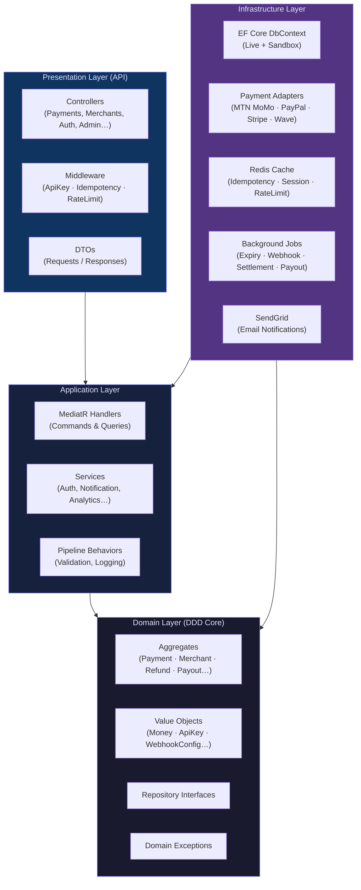

---

### Domain Model

The domain is organized into **bounded contexts**, each owning its aggregate root, value objects, and invariants.

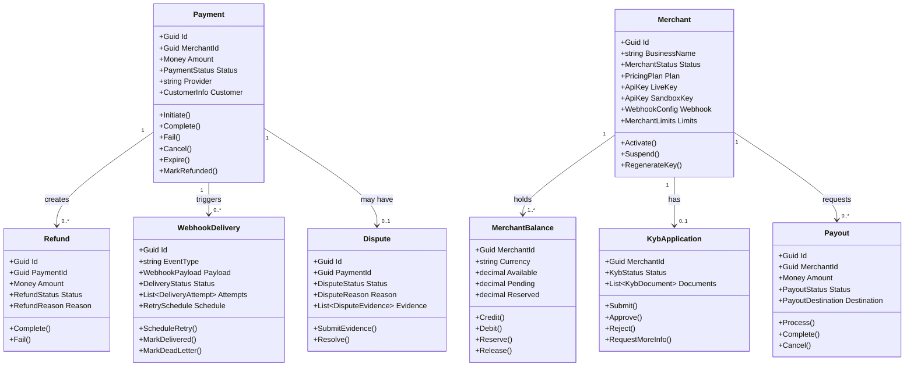

---

### Infrastructure

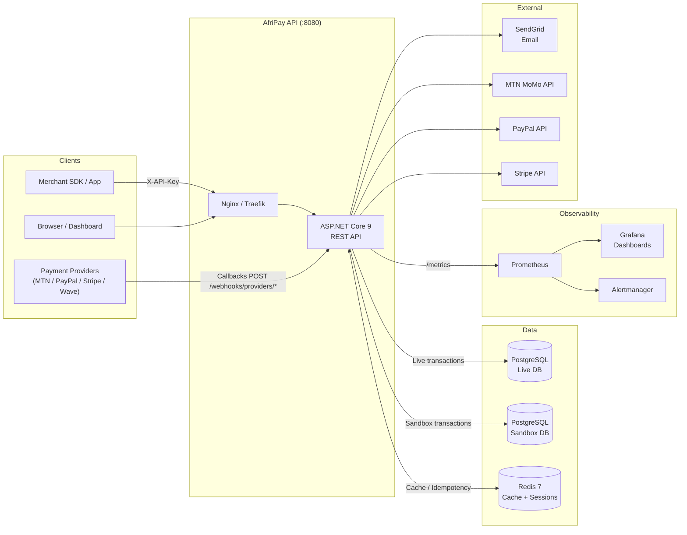

---

## Payment Flows

### Payment Lifecycle

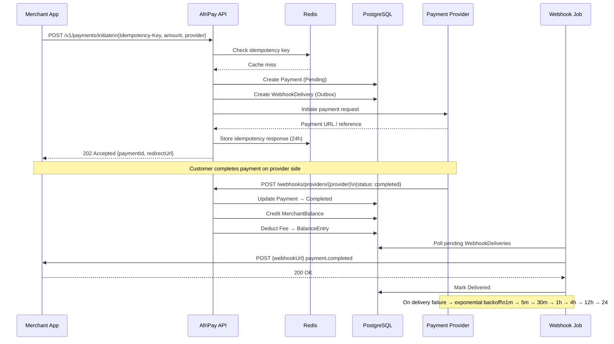

---

### Payment Status Machine

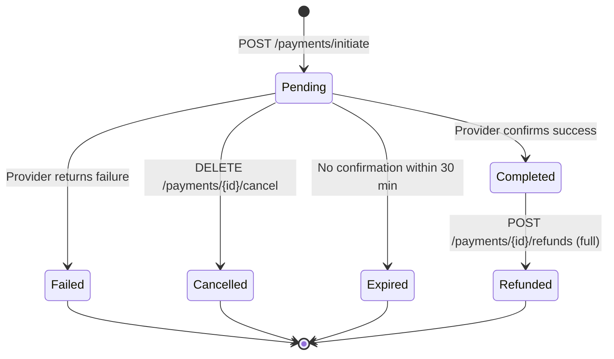

---

### Refund Flow

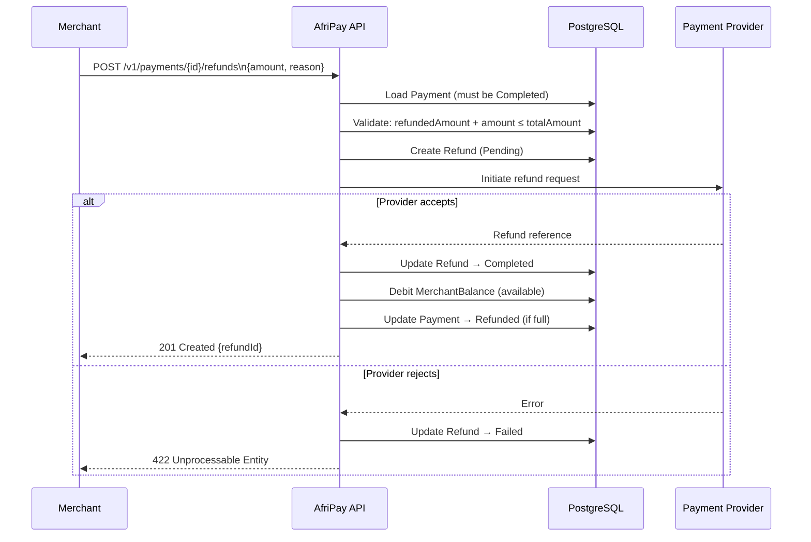

---

### KYB State Machine

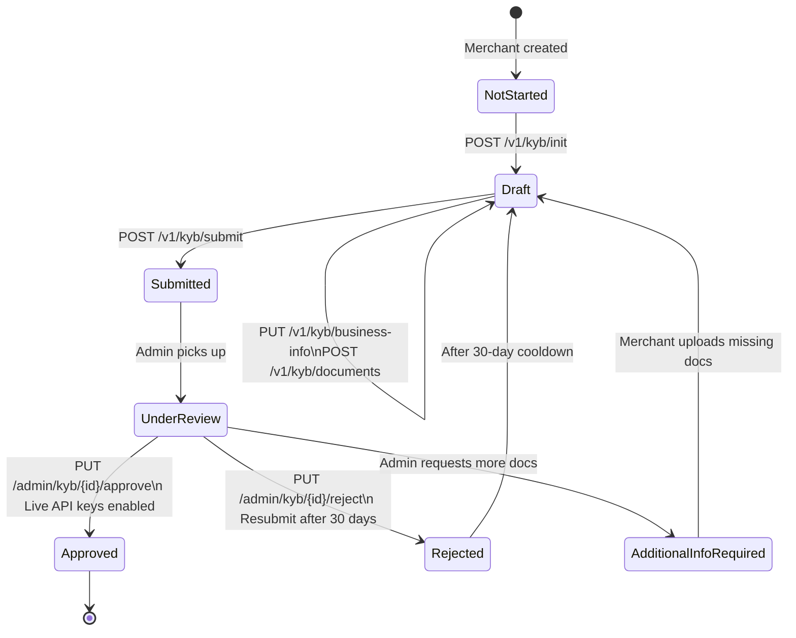

---

### Webhook Outbox Pattern

Webhooks are created atomically with the triggering business event (payment, refund, etc.) and delivered asynchronously by a background job, guaranteeing at-least-once delivery.

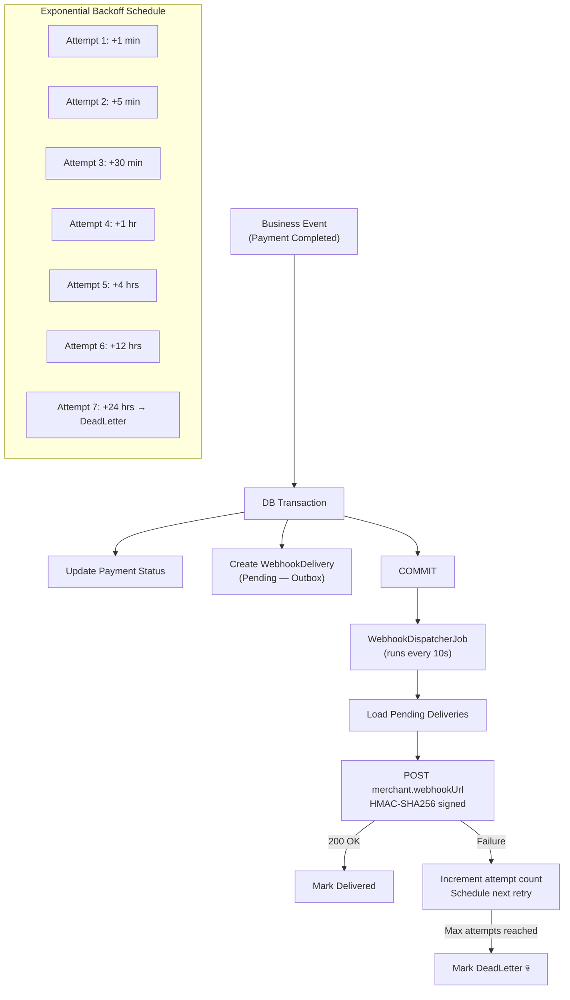

---

### Dispute (Chargeback) Flow

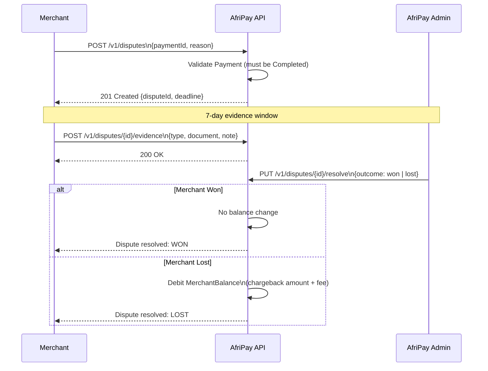

---

## API Reference

All authenticated endpoints require the header `X-API-Key: afp_live_sk_*` (production) or `X-API-Key: afp_test_sk_*` (sandbox).

Idempotent write operations accept an `Idempotency-Key: <uuid>` header.

### Payments

| Method | Endpoint | Auth | Description |
|---|---|---|---|
| `POST` | `/v1/payments/initiate` | Required | Initiate a new payment |
| `GET` | `/v1/payments/{id}` | Required | Get payment details |
| `DELETE` | `/v1/payments/{id}/cancel` | Required | Cancel a pending payment |
| `GET` | `/v1/payments` | Required | List payments (filterable, paginated) |

### Refunds

| Method | Endpoint | Auth | Description |
|---|---|---|---|
| `POST` | `/v1/payments/{id}/refunds` | Required | Create a refund |
| `GET` | `/v1/payments/{id}/refunds` | Required | List refunds for a payment |
| `GET` | `/v1/refunds/{refundId}` | Required | Get refund details |

### Merchants & Authentication

| Method | Endpoint | Auth | Description |
|---|---|---|---|
| `POST` | `/v1/merchants` | None | Create merchant account |
| `GET` | `/v1/merchants/me` | Required | Get merchant profile |
| `PUT` | `/v1/merchants/me/webhook` | Required | Update webhook configuration |
| `POST` | `/v1/merchants/me/api-keys/regenerate` | Required | Regenerate API key |
| `POST` | `/v1/auth/register` | None | Register merchant |
| `POST` | `/v1/auth/login` | None | Login (returns JWT) |
| `POST` | `/v1/auth/refresh` | None | Refresh access token |
| `PUT` | `/v1/auth/password` | Required | Change password |
| `GET` | `/v1/auth/me` | Required | Get current user |

### KYB / Compliance

| Method | Endpoint | Auth | Description |
|---|---|---|---|
| `GET` | `/v1/kyb` | Required | Get KYB status |
| `POST` | `/v1/kyb/init` | Required | Initialize KYB application |
| `PUT` | `/v1/kyb/business-info` | Required | Set business information |
| `POST` | `/v1/kyb/documents` | Required | Upload KYB document |
| `POST` | `/v1/kyb/submit` | Required | Submit KYB for review |

### Balance & Payouts

| Method | Endpoint | Auth | Description |
|---|---|---|---|
| `GET` | `/v1/balance/{currency}` | Required | Get balance for currency |
| `GET` | `/v1/balance` | Required | List all balances |
| `GET` | `/v1/balance/entries` | Required | List ledger entries |
| `POST` | `/v1/payouts` | Required | Request a payout |
| `GET` | `/v1/payouts/{id}` | Required | Get payout details |
| `GET` | `/v1/payouts` | Required | List payouts |
| `DELETE` | `/v1/payouts/{id}` | Required | Cancel pending payout |

### Webhooks, Disputes & Subscriptions

| Method | Endpoint | Auth | Description |
|---|---|---|---|
| `GET` | `/v1/webhooks` | Required | List webhook deliveries |
| `POST` | `/v1/webhooks/{deliveryId}/retry` | Required | Retry failed delivery |
| `POST` | `/webhooks/providers/{provider}` | None | Receive provider callback |
| `POST` | `/v1/disputes` | Required | Open a dispute |
| `POST` | `/v1/disputes/{id}/evidence` | Required | Submit evidence |
| `PUT` | `/v1/disputes/{id}/resolve` | Admin | Resolve dispute |
| `POST` | `/v1/subscriptions/plans` | Required | Create billing plan |
| `POST` | `/v1/subscriptions` | Required | Create subscription |
| `DELETE` | `/v1/subscriptions/{id}` | Required | Cancel subscription |

### Admin

| Method | Endpoint | Auth | Description |
|---|---|---|---|
| `GET` | `/v1/admin/merchants` | Admin | List all merchants |
| `POST` | `/v1/admin/merchants/{id}/suspend` | Admin | Suspend merchant |
| `PUT` | `/v1/admin/merchants/{id}/plan` | Admin | Change pricing plan |
| `PUT` | `/v1/admin/kyb/{id}/approve` | Admin | Approve KYB application |
| `PUT` | `/v1/admin/kyb/{id}/reject` | Admin | Reject KYB application |

### Utility

| Method | Endpoint | Auth | Description |
|---|---|---|---|
| `GET` | `/v1/currency/rates` | Required | Get exchange rates |
| `POST` | `/v1/currency/convert` | Required | Convert amount |
| `GET` | `/v1/analytics/summary` | Required | Sales analytics |
| `GET` | `/v1/audit/{entityType}/{entityId}` | Required | Audit trail |
| `GET` | `/health` | None | Health check |
| `GET` | `/docs` | None | Swagger UI |

---

## Tech Stack

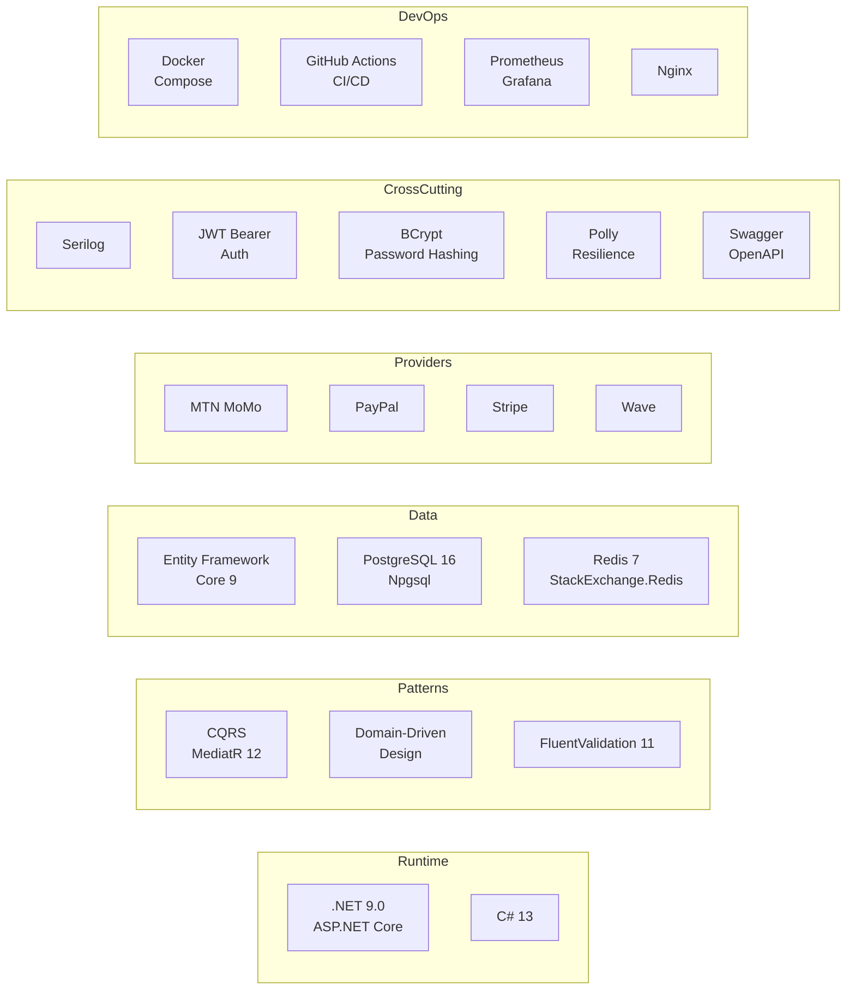

| Category | Technology | Version |
|---|---|---|
| Runtime | .NET / ASP.NET Core | 9.0 |
| Language | C# | 13 |
| CQRS | MediatR | 12.x |
| Validation | FluentValidation | 11.x |
| ORM | Entity Framework Core | 9.0 |
| Database | PostgreSQL | 16 |
| Cache | Redis (StackExchange.Redis) | 7 |
| Auth | JWT Bearer + BCrypt | — |
| HTTP Resilience | Polly | 8.6 |
| Logging | Serilog | 4.3 |
| Docs | Swagger / Swashbuckle | 6.x |
| Email | SendGrid | — |
| Metrics | Prometheus + Grafana | — |
| Container | Docker + Docker Compose | — |
| CI/CD | GitHub Actions | — |
| Proxy | Nginx | — |

---

## Getting Started

### Prerequisites

- [.NET 9 SDK](https://dotnet.microsoft.com/download/dotnet/9)
- [Docker Desktop](https://www.docker.com/products/docker-desktop/) (for infrastructure)
- [PostgreSQL 16](https://www.postgresql.org/download/) or use Docker
- [Redis 7](https://redis.io/download/) or use Docker

### Local Setup

```bash
# 1. Clone the repository
git clone https://github.com/your-org/AfriPay.git
cd AfriPay

# 2. Copy and fill in secrets
cp appsettings.secrets.json.example appsettings.secrets.json
# Edit appsettings.secrets.json with your provider credentials

# 3. Start infrastructure (PostgreSQL + Redis)
docker compose up postgres-live postgres-sand redis -d

# 4. Apply database migrations
dotnet ef database update --context LiveDbContext
dotnet ef database update --context SandboxDbContext

# 5. Run the API
dotnet run --project AfriPay.csproj

# API available at: http://localhost:5000
# Swagger UI at:    http://localhost:5000/docs
```

### Docker Compose

```bash
# Full production stack (API + PostgreSQL live + PostgreSQL sandbox + Redis)
docker compose up -d

# With monitoring (Prometheus + Grafana + Alertmanager)
docker compose -f docker-compose.yaml -f docker-compose.monitoring.yaml up -d

# View logs
docker compose logs -f afripay-api

# Health check
curl http://localhost:8080/health
```

---

## Configuration

Key settings in `appsettings.json` (secrets go in `appsettings.secrets.json`):

```json
{
  "ConnectionStrings": {
    "AfriPayLive":    "Host=localhost;Port=5432;Database=afripay_live;Username=postgres;Password=...",
    "AfriPaySandbox": "Host=localhost;Port=5432;Database=afripay_sandbox;Username=postgres;Password=...",
    "Redis":          "localhost:6379,abortConnect=false"
  },
  "Jwt": {
    "Secret":           "<min-32-char-secret>",
    "Issuer":           "AfriPay",
    "Audience":         "AfriPay",
    "ExpiresInMinutes": "15"
  },
  "Providers": {
    "MtnMomo": {
      "BaseUrl":          "https://sandbox.momodeveloper.mtn.com",
      "SubscriptionKey":  "...",
      "ApiUserId":        "...",
      "ApiKey":           "..."
    },
    "PayPal": {
      "BaseUrl":    "https://api-m.sandbox.paypal.com",
      "ClientId":   "...",
      "Secret":     "..."
    },
    "Stripe": {
      "SecretKey": "sk_test_..."
    }
  },
  "SendGrid": {
    "ApiKey":    "SG...",
    "FromEmail": "noreply@afripay.io"
  }
}
```

### Rate Limits by Plan

| Plan | Requests/min | Queue Size |
|---|---|---|
| Starter | 100 | 10 |
| Growth | 1,000 | 50 |
| Scale | Unlimited | — |

---

## Deployment

### CI/CD Pipeline

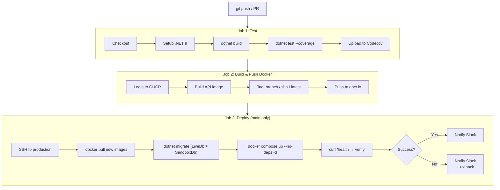

### Infrastructure Diagram

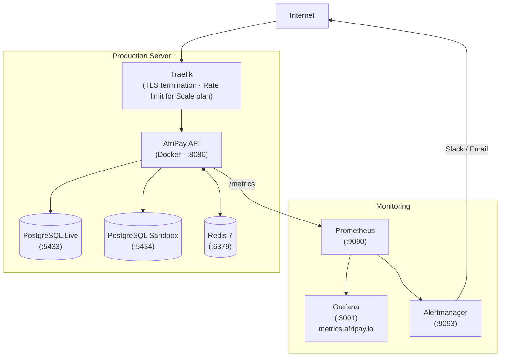

---

## Monitoring & Observability

AfriPay ships with a full observability stack:

| Tool | Purpose | URL |
|---|---|---|
| **Serilog** | Structured logging (JSON) | stdout / file |
| **Prometheus** | Metrics collection (15s scrape) | `:9090` |
| **Grafana** | Dashboards & visualization | `:3001` |
| **Alertmanager** | Alert routing (Slack/email) | `:9093` |

**Health checks** are exposed at `GET /health` and cover:
- PostgreSQL Live database
- PostgreSQL Sandbox database
- Redis

**Key metrics scraped:**
- ASP.NET Core built-in HTTP metrics (latency, status codes, throughput)
- PostgreSQL connection pool metrics
- Redis hit/miss rate

```bash
# Start monitoring stack
docker compose -f docker-compose.monitoring.yaml up -d

# Access dashboards
open http://localhost:3001   # Grafana (admin / your-password)
open http://localhost:9090   # Prometheus
```

---

## Security

| Mechanism | Details |
|---|---|
| **API Key Authentication** | `X-API-Key` header; keys stored as SHA-256 hash; validated via Redis fast-path |
| **JWT Tokens** | Access token (15 min) + refresh token; RS256 signing; stored claims: merchantId, email, plan |
| **Password Hashing** | BCrypt with work factor 12 |
| **Idempotency** | `Idempotency-Key` header; Redis-backed (24-hour TTL) |
| **Webhook Signatures** | HMAC-SHA256 over payload body; `X-AfriPay-Signature` header |
| **Rate Limiting** | Sliding window per plan; 429 on excess |
| **HTTPS** | TLS enforced at Traefik / Nginx proxy layer |
| **Sensitive data** | No PII in logs; sensitive logging disabled in production |
| **API Key Scoping** | `afp_live_sk_*` for production; `afp_test_sk_*` for sandbox — each scoped to their own database |

---

## Testing

```bash
# Run all unit tests
dotnet test tests/AfriPay.Tests.csproj

# Run with coverage report
dotnet test tests/AfriPay.Tests.csproj \
  --collect:"XPlat Code Coverage" \
  --results-directory ./coverage

# Coverage by domain
dotnet test --filter "FullyQualifiedName~Domain.Payments"
dotnet test --filter "FullyQualifiedName~Domain.Merchants"
```

**Test coverage by bounded context:**

| Bounded Context | Tests |
|---|---|
| Payments | Status machine, initiation, cancellation, expiry |
| Refunds | Full/partial refund, amount validation |
| Merchants | API key generation, webhook config, rate limits |
| Balance | Credit, debit, reservation, ledger entries |
| Fee | Fixed, percentage, tiered calculation |
| KYB | State transitions, document validation |
| Disputes | Evidence submission, resolution outcomes |
| Currency | Pair conversion, rate caching |
| Webhooks | Retry schedule, HMAC signature |

---

## Project Structure

```
AfriPay/
├── src/
│   ├── API/                        # HTTP layer
│   │   ├── Controllers/            # 18 REST controllers
│   │   ├── Contracts/              # Request & Response DTOs
│   │   ├── Middleware/             # ApiKey · Idempotency · RateLimit
│   │   ├── Extensions/             # Result → HTTP mapping helpers
│   │   └── Swagger/                # OpenAPI configuration
│   │
│   ├── Application/                # Use cases (CQRS via MediatR)
│   │   ├── Payments/               # Initiate, Get, List, Cancel handlers
│   │   ├── Refunds/                # Create, Get, List handlers
│   │   ├── Merchants/              # Create, profile, API key handlers
│   │   ├── Auth/                   # Login, register, refresh, password
│   │   ├── KYB/                    # KYB workflow handlers
│   │   ├── Balance/                # Balance query handlers
│   │   ├── Disputes/               # Dispute handlers
│   │   ├── Payouts/                # Payout handlers
│   │   ├── Subscriptions/          # Subscription & plan handlers
│   │   ├── Webhook/                # Delivery & retry handlers
│   │   ├── Analytics/              # Reporting handlers
│   │   ├── Audit/                  # Audit trail handlers
│   │   ├── Admin/                  # Admin operations
│   │   ├── Employees/              # Team management
│   │   ├── Currency/               # Exchange rate handlers
│   │   ├── Notifications/          # SendGrid email service
│   │   └── Common/                 # Shared errors, behaviors, DTOs
│   │
│   ├── Domain/                     # Pure business logic (no dependencies)
│   │   ├── Payments/               # Payment aggregate + status machine
│   │   ├── Refunds/                # Refund aggregate
│   │   ├── Merchants/              # Merchant aggregate + API key
│   │   ├── Balance/                # Balance aggregate + ledger
│   │   ├── KYB/                    # KYB workflow aggregate
│   │   ├── Disputes/               # Dispute aggregate
│   │   ├── Payouts/                # Payout aggregate
│   │   ├── Subscriptions/          # Subscription aggregate
│   │   ├── Webhooks/               # Outbox aggregate + retry schedule
│   │   ├── Fee/                    # Fee rule & calculation
│   │   ├── Currency/               # Exchange rate aggregate
│   │   ├── Audit/                  # Audit trail entity
│   │   ├── Staff/                  # Internal staff aggregate
│   │   ├── Employees/              # Merchant team aggregate
│   │   └── Repositories/           # Repository interfaces (17 interfaces)
│   │
│   └── Infrastructure/             # External concerns
│       ├── Persistence/            # EF Core: LiveDbContext + SandboxDbContext + UoW
│       ├── Providers/              # MtnMomo · PayPal · Stripe · Wave adapters
│       ├── Caching/                # Redis: CacheService + CacheKeys + TTL
│       └── Jobs/                   # ExpiryJob · WebhookDispatcherJob · SettlementJob · PayoutSchedulerJob
│
├── Migrations/
│   ├── LiveDb/                     # PostgreSQL live migrations (4 phases)
│   └── SandboxDb/                  # PostgreSQL sandbox migrations
│
├── tests/
│   └── Domain/                     # Unit tests per bounded context
│
├── Dockerfile                      # Multi-stage build (SDK → Publish → Runtime)
├── docker-compose.yaml             # Production stack
├── docker-compose.monitoring.yaml  # Prometheus + Grafana + Alertmanager
├── nginx.conf                      # Frontend SPA server
├── Prometheus.yaml                 # Scrape configuration
├── deploy.yaml                     # GitHub Actions CI/CD pipeline
└── AfriPay.csproj                  # .NET 9 project file
```

---

## Background Jobs

| Job | Interval | Responsibility |
|---|---|---|
| `ExpiryJob` | Every minute | Expire payments pending for more than 30 minutes |
| `WebhookDispatcherJob` | Every 10 seconds | Dispatch pending webhook deliveries; schedule retries on failure |
| `SettlementJob` | Daily | Settle pending balance entries; move funds from pending → available |
| `PayoutSchedulerJob` | Daily | Trigger automatic payouts for merchants with daily/weekly/monthly schedules |

---

## Contributing

1. Fork the repository
2. Create a feature branch: `git checkout -b feat/my-feature`
3. Write tests covering your changes
4. Run the test suite: `dotnet test`
5. Open a pull request — the CI pipeline will run automatically

---

## License

This project is licensed under the [MIT License](LICENSE).

---

*Built with for the African fintech ecosystem.*